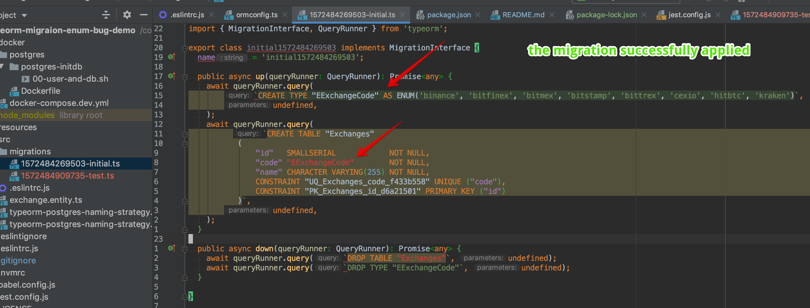
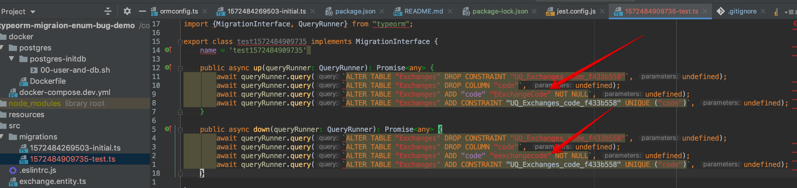

# TypeORM Enum bug demo

### Description

Enum's with a custom name in Pascal Case (`EExchangeCode` in my example) handled incorrectly by the `migration:generate`.  

1. The first migration generated with an empty database.

I successfully applied it.

2. The second migration generated with the same command `migrations:generate` after the first one was applied. 


**There are no any changes in the `Exchange` entity. We should not have the migration.**

### My environment

* Node JS `12`
* TypeScript `3.6.4`
* PostgreSQL `12`
* `pg` driver `7.12.1`
* TypeORM `0.2.20`

### Steps to reproduce or a small repository showing the problem:

1. Execute this
```bash
# preparation
git clone git@github.com:korniychuk/typeorm-migraion-enum-bug-demo.git
cd typeorm-migraion-enum-bug-demo
npm install
npm run db:docker:dev    # requires docker and docker-compose
npm run migrations:run   # in the another terminal window

# demo of the problem
npm run migrations:diff test
```

2. Than look newly generated migration in `src/migrations`
